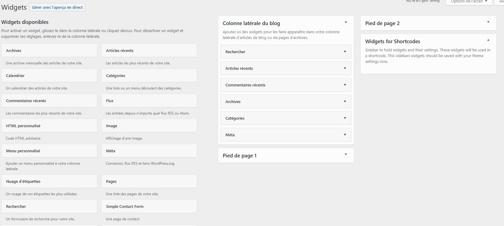
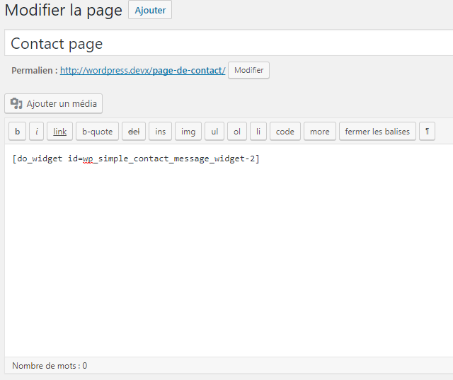
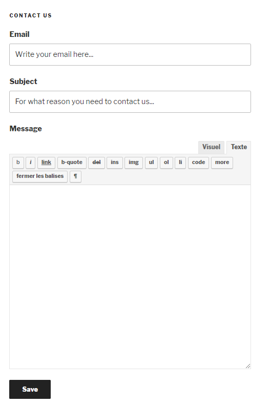

# WP Simple Contact

WP Simple Contact is a simple plugin for Wordpress (checked with WP 4.8.2) that allow the user to create a contact page.
The client"s requests are sended by mail and stored in a custom table in Wordpress, you can also display the records in the admin menu.

## Installation

First, install the "amr shortcode any widget"' plugin from the Wordpress repository plugin.

Then, download the ZIP of the WP Simple Contact plugin and proceed the standard manual installation method of a Wordpress plugin (see [Managing plugins](https://codex.wordpress.org/Managing_Plugins)). 

## Basic Usage

Step 1 : Activate the widget in order to use it as a shortcode in a page

Step 2 : Create a page and paste it the shortcode of the widget

Step 3 : In Wordpress, link the page to a menu item

Setp 4 : Go to your contact page and enjoy !

